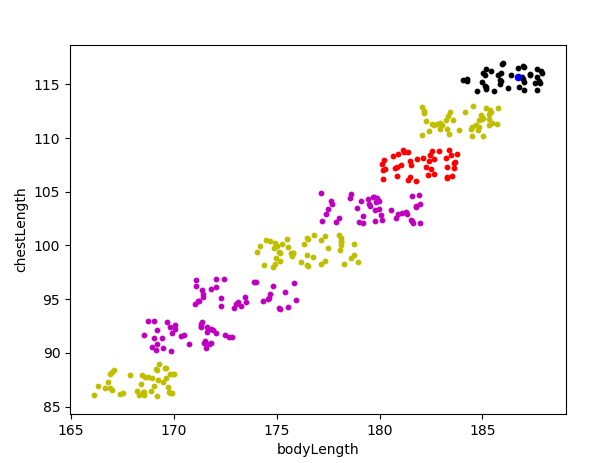

# KNN algorithm in python
The K-neareast neighbor algorithm helps to classify data without a training process. Classify a new datapoint by looking for the n next datapoints of your training set. Then look at the classes of these n datapoints and group in your new datapoint. Please note that n % 2 = 0 could give you an error because you can produce two classes with the same number of siblings. If you want you can easily add other datasets to it.

## Gallery

See an example of classifing clothing sizes:

and the class for the blue testpoint at the upper right corner of the plot

### Install

Just download and execute with python
